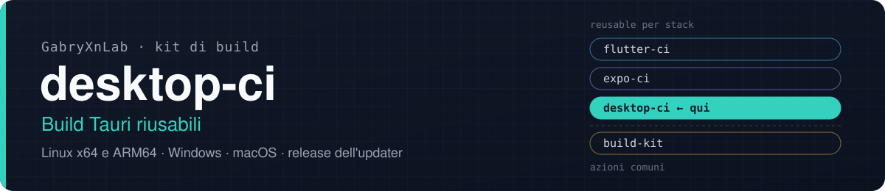
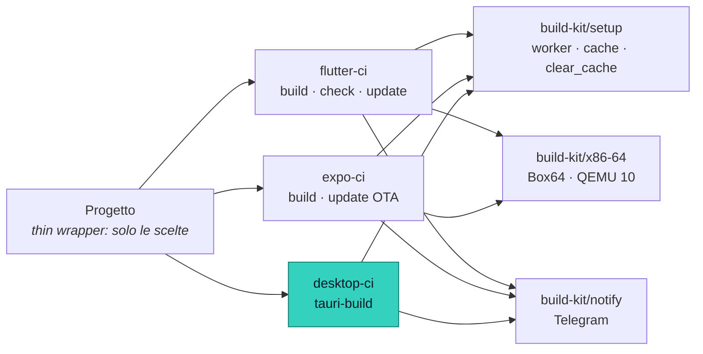

<p align="center">
  
</p>

<p align="center">
  <a href="https://github.com/GabryXnLab/flutter-ci">flutter-ci</a> ·
  <a href="https://github.com/GabryXnLab/expo-ci">expo-ci</a> ·
  <a href="https://github.com/GabryXnLab/desktop-ci"><b>desktop-ci</b></a> ·
  <a href="https://github.com/GabryXnLab/build-kit">build-kit</a>
</p>

<p align="center">
  
  
  
  <a href="https://github.com/GabryXnLab/desktop-ci/commits/main"></a>
</p>

**Installer di un'app desktop Tauri v2 per Linux (x64 e ARM64), Windows e macOS da un solo wrapper, ognuno compilato nativamente sul suo sistema, con la release dell'auto-updater facoltativa.**

[Perché](#perché) · [Avvio rapido](#avvio-rapido) · [Cosa c'è](#cosa-cè) · [Riferimento](#riferimento) · [Architettura](#architettura) · [Fuori dall'org](#usarlo-fuori-dallorg) · [Manutenzione](#per-chi-lo-mantiene)

## Perché

- **Quattro sistemi, un input.** `platforms: linux-x64,linux-arm64,windows,macos` diventa una matrice con un job per target, ognuno sul runner nativo: Tauri non cross-compila, e qui non ci si prova.
- **Le combinazioni impossibili si fermano prima di partire.** Un target che il runner scelto non può compilare fa fallire il job di preparazione con un errore che spiega come rimediare, e nessuna build parte a vuoto.
- **Veloce sul self-hosted ARM64.** La cartella target di cargo sta fuori dal checkout e sopravvive ai run (anche al checkout dei workflow mobile dello stesso repo, che prima la cancellava); sccache, condiviso da tutti i progetti Rust della macchina, compila le dipendenze una volta sola. Worker, cache e `clear_cache` vengono da [`build-kit/setup`](https://github.com/GabryXnLab/build-kit#setup-worker-e-cache).
- **Cache anche sui runner di GitHub**: `Swatinem/rust-cache` per registry e dipendenze compilate, lo store di pnpm o la cache di npm per il JavaScript, con chiave dal lockfile.
- **Installer anche senza chiave dell'updater.** Senza `TAURI_SIGNING_PRIVATE_KEY` si disattivano solo gli artefatti dell'updater, e gli installer escono lo stesso; una release dell'updater senza chiave invece fallisce subito, perché non firmata non sarebbe valida.
- **Release dell'updater senza release a metà.** Con `publish_release: true` il job `publish` parte solo se **tutti** i target sono riusciti, abbina ogni `.sig` al suo binario, scrive `latest.json` (schema Tauri v2) e pubblica la GitHub Release. Rilanciarlo aggiorna la stessa release invece di fallire.
- **Package manager dal lockfile**: `pnpm-lock.yaml` → pnpm (alla versione di `packageManager`), altrimenti `npm ci`.
- **Stessi input della famiglia** (`max_workers`, `clear_cache`) ed **esito su Telegram** per ogni target, con gli installer allegati.

## Avvio rapido

Nel progetto, `.github/workflows/build-desktop.yml`:

```yaml
name: Build desktop
run-name: Build desktop · ${{ github.ref_name }}

on:
  workflow_dispatch:

jobs:
  desktop:
    uses: GabryXnLab/desktop-ci/.github/workflows/tauri-build.yml@main
    with:
      app_name: MiaApp
      platforms: linux-x64,linux-arm64,windows,macos
      runner_type: github             # fuori dall'org è obbligatorio: vedi sotto
      project_dir: desktop            # la cartella con package.json e src-tauri/
```

Nessun secret è obbligatorio per gli installer:

| Secret | A cosa serve | Senza |
| :--- | :--- | :--- |
| `TAURI_SIGNING_PRIVATE_KEY`, `TAURI_SIGNING_PRIVATE_KEY_PASSWORD` | firma degli artefatti dell'updater | installer ordinari, senza artefatti dell'updater; `publish_release: true` fallisce |
| `RELEASES_TOKEN` | pubblicare la release su `releases_repo` | serve solo con `publish_release: true` |
| `SUBMODULES_TOKEN` | submodule privati di altri repo (PAT in sola lettura) | `github.token` |
| `TELEGRAM_BOT_TOKEN`, `TELEGRAM_CHAT_ID` | esito e installer su Telegram (con `telegram_topic_id`) | nessuna notifica, in silenzio |

I secret si passano **per nome**, mai con `secrets: inherit`: da un altro owner arriverebbero vuoti.

<details>
<summary>Release dell'auto-updater</summary>

```yaml
jobs:
  release:
    permissions:
      contents: write                 # con la release nello stesso repo
    uses: GabryXnLab/desktop-ci/.github/workflows/tauri-build.yml@main
    with:
      app_name: MiaApp
      platforms: linux-x64,linux-arm64,windows,macos
      runner_type: github
      project_dir: desktop
      publish_release: true
      releases_repo: ${{ github.repository }}
      release_notes: MiaApp desktop
    secrets:
      TAURI_SIGNING_PRIVATE_KEY: ${{ secrets.TAURI_SIGNING_PRIVATE_KEY }}
      TAURI_SIGNING_PRIVATE_KEY_PASSWORD: ${{ secrets.TAURI_SIGNING_PRIVATE_KEY_PASSWORD }}
      RELEASES_TOKEN: ${{ github.token }}
```

- Serve `createUpdaterArtifacts` attivo nel progetto; il job gira solo per build non di debug.
- La versione viene da `<project_dir>/src-tauri/tauri.conf.json` e il tag è `vX.Y.Z`. Se il tag esiste già, i file si sostituiscono (`upload --clobber`).
- La piattaforma di ogni file in `latest.json` si deduce dal nome dell'artefatto e si traduce nei nomi di Tauri v2 (`linux-x86_64`, `linux-aarch64`, `windows-x86_64`, `darwin-aarch64`, `darwin-x86_64`).
- **Sorgente privato?** Gli asset di una release privata non si scaricano in anonimo, e l'updater di Tauri fa richieste senza autenticazione: si pubblica in un repo pubblico dedicato ai soli binari (`releases_repo`), con un `RELEASES_TOKEN` che abbia Contents in lettura e scrittura solo su quel repo.

Limiti di oggi: nella release finiscono solo i file firmati per l'updater (niente `.deb`, `.rpm`, `.dmg`), non c'è un file SHA-256, e il titolo della release è ancora fisso («WarpMobile Desktop vX.Y.Z»), come il testo di ripiego delle note se `release_notes` è vuoto.

</details>

## Cosa c'è

[`tauri-build.yml`](.github/workflows/tauri-build.yml), tre job:

| Job | Dove | Cosa fa |
| :--- | :--- | :--- |
| `setup` | `ubuntu-latest` | traduce `platforms` e `runner_type` nella matrice dei target e rifiuta le combinazioni impossibili |
| `build` | il runner di ogni target | `tauri build`, bundle come artefatti del run (3 giorni) e su Telegram |
| `publish` | `ubuntu-latest` | facoltativo: GitHub Release e `latest.json` dell'updater |

| Target | Bundle | Serve |
| :--- | :--- | :--- |
| `linux-x64` | `.deb` `.AppImage` `.rpm` (x86_64) | Linux x86_64 con GTK e WebKit |
| `linux-arm64` | `.deb` `.AppImage` `.rpm` (aarch64) | Linux ARM64 con GTK e WebKit |
| `windows` | `.msi` `.exe` (NSIS, x86_64) | Windows con MSVC e WebView2 |
| `macos` | `.dmg` `.app` (Apple Silicon) | un host macOS con Xcode CLT |

Alias accettati: `linux` → `linux-arm64`, `x64`/`x86_64` → `linux-x64`, `win` → `windows`, `mac`/`darwin` → `macos`. Su Linux le librerie di sistema (`libwebkit2gtk-4.1-dev`, `libgtk-3-dev`, `libsoup-3.0-dev`, `libayatana-appindicator3-dev`, `librsvg2-dev`) si installano da sole sui runner di GitHub, e con `install_system_deps` sugli altri.

## Riferimento

<details>
<summary><code>tauri-build.yml</code>: input</summary>

| Input | Default | |
| :--- | :--- | :--- |
| `app_name` | obbligatorio | nome degli artefatti e delle notifiche |
| `platforms` | obbligatorio | target separati da virgola: `linux-x64`, `linux-arm64`, `windows`, `macos` |
| `runner_type` | `self-hosted` | `self-hosted` \| `github` (vedi [Architettura](#architettura)) |
| `project_dir` | `desktop` | la cartella con `package.json` e `src-tauri/` |
| `max_workers` | `auto` | worker di cargo: `auto` \| `2` \| `4` |
| `clear_cache` | `false` | sul self-hosted cancella la target di cargo del repo e mette sccache in `RECACHE`; su GitHub non riprende né salva le cache |
| `build_debug` | `false` | build di debug, più veloce e senza release |
| `has_submodules` | `false` | checkout con `submodules: recursive` |
| `install_system_deps` | `false` | forza l'installazione delle librerie GTK e WebKit su Linux (sui runner di GitHub avviene comunque) |
| `setup_rust` | `true` | toolchain Rust stable con rustup |
| `node_version` | `22` | versione di Node.js |
| `selfhosted_linux_runner` | `["self-hosted","nexus-core"]` | `runs-on` di `linux-arm64` con `runner_type: self-hosted` e senza override (JSON); il default è il runner self-hosted dell'org |
| `linux_x64_runner`, `linux_arm64_runner`, `windows_runner`, `macos_runner` | `''` | `runs-on` di quel target (JSON), sopra al default di `runner_type` |
| `publish_release` | `false` | dopo la build, GitHub Release e `latest.json` su `releases_repo` |
| `releases_repo` | `''` | `owner/repo` della release; obbligatorio con `publish_release` |
| `release_notes` | `''` | note della release e di `latest.json` |
| `telegram_topic_id` | `''` | topic del supergruppo; vuoto = nessuna notifica |

Secret: `TAURI_SIGNING_PRIVATE_KEY`, `TAURI_SIGNING_PRIVATE_KEY_PASSWORD`, `RELEASES_TOKEN`, `SUBMODULES_TOKEN`, `TELEGRAM_BOT_TOKEN`, `TELEGRAM_CHAT_ID`, tutti facoltativi.

</details>

## Architettura



Dove gira ogni target:

| Target | `runner_type: github` | `runner_type: self-hosted` |
| :--- | :--- | :--- |
| `linux-x64` | `ubuntu-latest` | errore, salvo `linux_x64_runner` |
| `linux-arm64` | `ubuntu-24.04-arm` | `selfhosted_linux_runner` (il runner dell'org) |
| `windows` | `windows-latest` | errore, salvo `windows_runner` |
| `macos` | `macos-latest` | errore, salvo `macos_runner` |

Un override `*_runner` vince sempre sul default di `runner_type`.

## Usarlo fuori dall'org

Il repo è pubblico e chiunque può chiamare questo workflow. Cosa sapere:

- **Passa `runner_type: github`.** Tutti e quattro i target girano sui runner di GitHub, gratis nei repo pubblici (macOS e Windows compresi). Il default `self-hosted` manda `linux-arm64` sul runner dell'org (etichetta `nexus-core`), da cui un altro repo resterebbe in coda, e rifiuta gli altri target.
- **Con un tuo runner self-hosted** puoi indicarlo con `selfhosted_linux_runner` o con gli override `*_runner`. Il workflow prepara Rust, Node e (con `install_system_deps`) le librerie di sistema, ma è provato solo sul runner dell'org.
- **Telegram è facoltativo.** Senza i secret non parte niente e il job non fallisce. Con il tuo bot e il tuo supergruppo ricevi esito e installer; i pulsanti con callback restano muti, perché li gestisce il bot dell'org.
- **Fissa una versione.** `@main` cambia per tutti a ogni push. Da fuori conviene uno SHA:

  ```yaml
  uses: GabryXnLab/desktop-ci/.github/workflows/tauri-build.yml@<sha di un commit>
  ```

  Il workflow chiama a sua volta `build-kit/…@main`: lo SHA fissa `desktop-ci`, non quelle azioni. Per fissare tutto, fai un fork.

## Per chi lo mantiene

- **`@main` è live per tutti**: un push qui cambia ogni progetto al run successivo. Input nuovi con `default`, mai rinominati né tolti senza aggiornare tutti i wrapper.
- **Deve restare pubblico**, come [`build-kit`](https://github.com/GabryXnLab/build-kit): un repo pubblico non può usare azioni di repo privati. Token e chiavi arrivano sempre dai secret di chi chiama.
- **Il nome dell'input del runner è diverso**: qui si chiama `runner_type`, negli altri reusable `runner`, con gli stessi valori.
- In sospeso: firma e notarizzazione macOS e firma del codice Windows (secret e step andranno qui, non nei wrapper), titolo della release parametrico.
- I vincoli e il loro perché sono in [`CLAUDE.md`](CLAUDE.md); l'architettura comune nel [`CLAUDE.md` di build-kit](https://github.com/GabryXnLab/build-kit/blob/main/CLAUDE.md).

## Licenza

Il repo non ha ancora un file di licenza: il codice è visibile e il workflow si può chiamare, ma non è concesso esplicitamente in licenza.
